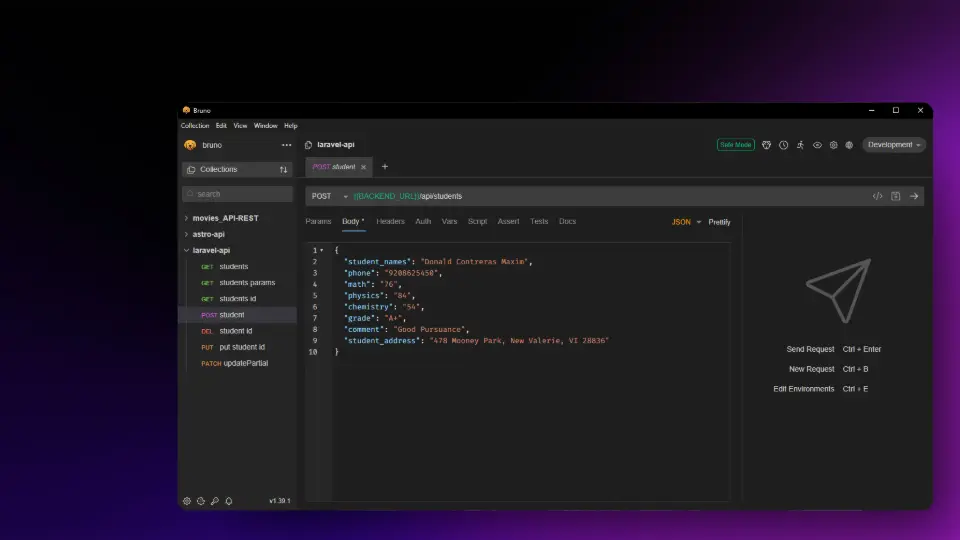

# Students API - Laravel

Esta API RESTful permite gestionar estudiantes mediante operaciones CRUD (Crear, Leer, Actualizar y Eliminar).

<p align="center">
  
</p>

## Tabla de Contenidos

- [Students API - Laravel](#students-api---laravel)
  - [Tabla de Contenidos](#tabla-de-contenidos)
  - [Requisitos Previos](#requisitos-previos)
  - [Instalación](#instalación)
  - [Configuración](#configuración)
  - [Uso](#uso)
  - [Rutas de la API](#rutas-de-la-api)
    - [Detalles de las Rutas](#detalles-de-las-rutas)
    - [URL Base](#url-base)
      - [Obtener todos los estudiantes](#obtener-todos-los-estudiantes)
      - [Buscar estudiantes por parámetro](#buscar-estudiantes-por-parámetro)
      - [Obtener detalles de un estudiante por ID](#obtener-detalles-de-un-estudiante-por-id)
      - [Crear un nuevo estudiante](#crear-un-nuevo-estudiante)
      - [Eliminar un estudiante por ID](#eliminar-un-estudiante-por-id)
      - [Actualizar un estudiante (Reemplazo completo)](#actualizar-un-estudiante-reemplazo-completo)
      - [Actualizar parcialmente un estudiante](#actualizar-parcialmente-un-estudiante)
  - [Tecnologías Usadas](#tecnologías-usadas)
  - [Recursos](#recursos)
  - [Licencia](#licencia)

## Requisitos Previos

- Laravel 11.39.1
- PHP 8.4.4
- Docker y Docker Compose instalados
- MySQL Client (opcional, para gestionar la base de datos manualmente)
- Bruno o cualquier otra herramienta para probar APIs

## Instalación

1. Clona este repositorio:
   ```bash
   git clone https://github.com/WillJkdev/laravel-crud-api.git
   cd laravel-crud-api
   ```
2. En caso de no usar Docker, instala las dependencias de PHP:
   ```bash
   composer install
   ```

---

## Configuración

1. Crea el archivo `.env` en la raíz del proyecto. Puedes usar el archivo `.env.example` como referencia.
2. Levanta el contenedor MySQL.
   ```bash
   docker compose up -d --build
   ```
3. Configuración Manual de MySQL (opcional) Si no deseas usar Docker, puedes configurar MySQL manualmente y luego usar el siguiente comando para hacer la migración de la base de datos:
   ```bash
   php artisan migrate
   ```
4. Opcionalmente, puedes ejecutar el siguiente comando para poblar la base de datos con datos de prueba:
   ```bash
   docker exec -it laravel_app php artisan import:students storage/app/estudiantes.csv
   ```

---

## Uso

1. Para iniciar el servidor accede al enlace de Nginx:
   ```bash
   localhost:8000
   ```
2. También puedes usar el siguiente comando para iniciar el servidor de desarrollo:
   ```bash
   php artisan serve
   ```

---

## Rutas de la API

| **Entidad** | **Método** | **Endpoint**    | **Descripción**                                |
| ----------- | ---------- | --------------- | ---------------------------------------------- |
| Students    | GET        | `/students`     | Listar todos los estudiantes.                  |
| Students    | GET        | `/students/:id` | Obtener detalles de un estudiante por ID.      |
| Students    | POST       | `/students`     | Crear un nuevo estudiante.                     |
| Students    | DELETE     | `/students/:id` | Eliminar un estudiante por ID.                 |
| Students    | PUT        | `/students/:id` | Actualizar un estudiante (reemplazo completo). |
| Students    | PATCH      | `/students/:id` | Actualizar parcialmente un estudiante.         |

### Detalles de las Rutas

Si usas Bruno, puedes importar la colección de rutas desde `/docs/api-collections`.

### URL Base

```
http://localhost:8000/api
```

#### Obtener todos los estudiantes

- **Endpoint:** `GET /students`
- **Descripción:** Retorna una lista de estudiantes registrados.

#### Buscar estudiantes por parámetro

- **Endpoint:** `GET /students?limit=5&page=2`
- **Descripción:** Filtra estudiantes con parámetros opcionales como paginación.

#### Obtener detalles de un estudiante por ID

- **Endpoint:** `GET /students/{id}`
- **Descripción:** Retorna la información detallada de un estudiante específico.

#### Crear un nuevo estudiante

- **Endpoint:** `POST /students`
- **Descripción:** Agrega un nuevo estudiante.
- **Headers:**
  - `Content-Type: application/json`
- **Body:**
  ```json
  {
    "student_names": "Donald Contreras Maxim",
    "phone": "9208625450",
    "math": "76",
    "physics": "84",
    "chemistry": "54",
    "grade": "A+",
    "comment": "Good Pursuance",
    "student_address": "478 Mooney Park, New Valerie, VI 28836"
  }
  ```

#### Eliminar un estudiante por ID

- **Endpoint:** `DELETE /students/{id}`
- **Descripción:** Elimina un estudiante del sistema.

#### Actualizar un estudiante (Reemplazo completo)

- **Endpoint:** `PUT /students/{id}`
- **Descripción:** Actualiza completamente la información de un estudiante.
- **Body:**
  ```json
  {
    "student_names": "Donald Contreras",
    "phone": "9208625450",
    "math": "76",
    "physics": "100",
    "chemistry": "0",
    "grade": "B+",
    "comment": "Good Pursuance",
    "student_address": "478 Mooney Park, New Valerie, VI 28836"
  }
  ```

#### Actualizar parcialmente un estudiante

- **Endpoint:** `PATCH /students/{id}`
- **Descripción:** Actualiza parcialmente la información de un estudiante.
- **Body:**
  ```json
  {
    "grade": "A+"
  }
  ```

---

## Tecnologías Usadas

- Laravel
- PHP
- Nginx
- MySQL
- Docker (para la base de datos, PHP y Nginx)

## Recursos

- [Documentación de Laravel](https://laravel.com/docs)
- [Documentación de Docker](https://docs.docker.com/)
- [MySQL Reference Manual](https://dev.mysql.com/doc/)

## Licencia

Este proyecto está licenciado bajo la [Licencia MIT](LICENSE).

